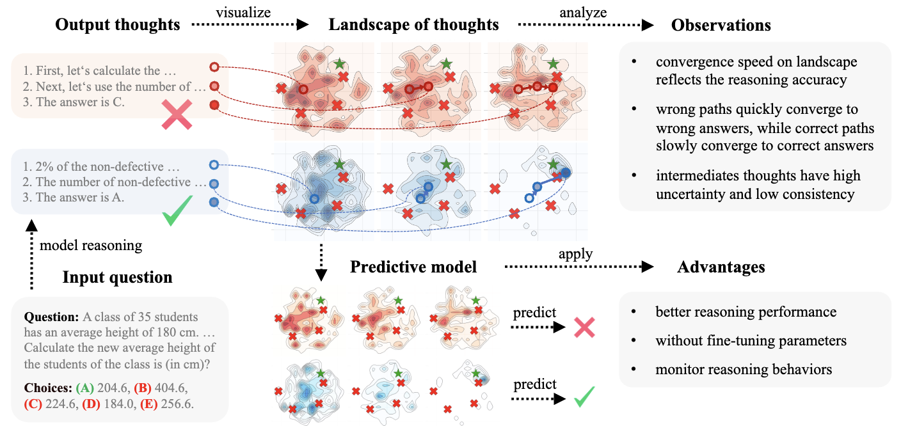

<div align="center">

<h1>🌌 Landscape of Thoughts</h1>
<h3>Visual Reasoning Paths of LLMs through Dimensional Projection</h3>

[](https://arxiv.org/abs/2311.03191)
[](https://github.com/tmlr-group/DeepInception)
[](https://huggingface.co/datasets/GazeEzio/Landscape-of-Thought)
[](TBD:ColabLink)

|          |
| :----------------------------: |
| Diagram of Lansacpe of Thought |

</div>

---

<!-- > [!TIP]
> Hello -->
<!-- > [!CAUTION]
> Hello -->

> [!NOTE]
> Before start analysing your own data, you may need to setup environment as described in [here](res/setup_model.md).

### 🔍 Analysis Pipeline

| Step                 | Command                                    | Output                                     | Documents                              |
| -------------------- | ------------------------------------------ | ------------------------------------------ | -------------------------------------- |
| 1. Collect Responses | `python step1-sample-reasoning-trace.py`   | `./exp-data-scale/*/thoughts/*.json`       | [link](./res/setup_environment.md#L43) |
| 2. Compute Distances | `python step-2-compute-distance-matrix.py` | `./exp-data-scale/*/distance_matrix/*.pkl` | [link](./res/setup_environment.md#L71) |
| 3. Generate Plots    | `python step-3-plot-landscape.py`          | `./figures/*.png`                          | [link]()                               |

## 🚀 Quickstart Pipeline

```bash
# Full Workflow Example
export TOGETHERAI_API_KEY=your_key_here

# Step 1: Data Collection
python step1-sample-reasoning-trace.py \
  --model_name meta-llama/Meta-Llama-3.1-8B-Instruct-Turbo \
  --dataset_name aqua

# Step 2: Distance Calculation
python step-2-compute-distance-matrix.py \
  --model_name meta-llama/Meta-Llama-3.1-8B-Instruct-Turbo \
  --dataset_name aqua

# Step 3: Visualization
python step-3-plot-landscape.py \
  --model_name Meta-Llama-3.1-8B-Instruct-Turbo \
  --dataset_name aqua
```

## 📜 Citation

```bibtex
@inprocessing{
  title={Landscape of Thought: XXX},
  author={XXX},
  booktitle={arXiv},
  year={2025},
}
```

## 📝 License

This project is licensed under the MIT License - see the [LICENSE.md](LICENSE.md) file for details
