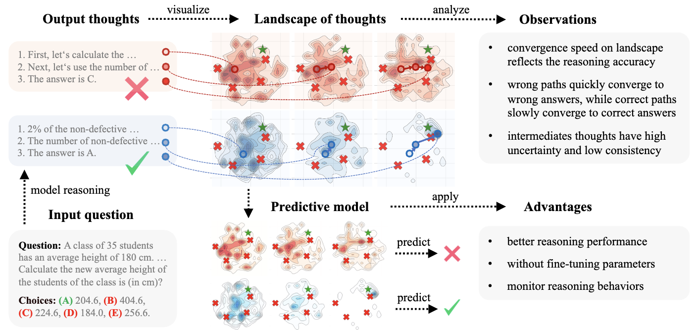

<div align="center">

<h1>Landscape of Thoughts</h1>
<h3>Visualizing the Reasoning Process of Large Language Models</h3>

[](https://arxiv.org/abs/2503.22165)
[](https://huggingface.co/datasets/GazeEzio/Landscape-Data)
[](https://colab.research.google.com/drive/1IgLREaEw-FeJbKn9NfYGIyaex2QhgCT2?usp=sharing)

|          |
| :------------------------------: |
| Diagram of Landscape of Thoughts |

</div>

---

> [!NOTE]
> Before start analysing your own data, you may need to setup model as described in [setup model](doc/setup_model.md).

## 📋 Overview

Landscape of Thoughts (LoT) is a framework for visualizing and analyzing the reasoning paths of Large Language Models (LLMs). This library provides tools to:

1. Sample reasoning traces from LLMs using various methods (CoT, ToT, MCTS)
2. Calculate distances between reasoning steps
3. Visualize the reasoning landscape through dimensional projection

## 🐍 Setting up Environment

```bash
# Create environment
conda create -n landscape python=3.10
conda activate landscape
pip3 install -r requirements.txt
# Use --use-pep517 flag to avoid deprecation warning with fire package
pip install fire --use-pep517
```

## 🚄 Simplified API

You can use our unified script (`main.py`) that combines all three steps into a single command:

```bash
python main.py \
  --task all \
  --model_name meta-llama/Llama-3.2-1B-Instruct \
  --dataset_name aqua \
  --method cot \
  --num_samples 10 \
  --start_index 0 \
  --end_index 5 \
  --plot_type method \
  --output_dir figures/landscape \
  --local \
  --local_api_key token-abc123 \
  --port 8000 # <== this should align with the port you used to host the model
```

The `task` parameter can be set to:

- `sample`: Only run the sampling step
- `calculate`: Only run the calculation step
- `plot`: Only run the visualization step
- `all`: Run the complete pipeline

This unified approach simplifies the workflow by handling all steps with consistent parameters and proper sequencing.

## 🧩 Library Usage

For more advanced usage, you can directly import functions from the `lot` package or use the main function:

```python
from lot import sample, calculate, plot

# Sample reasoning traces
features, metrics = sample(
    model_name="meta-llama/Meta-Llama-3-8B-Instruct-Lite",
    dataset_name="aqua",
    method="cot",
    num_samples=10,
    start_index=0,
    end_index=5
)

# Calculate distance matrices
distance_matrices = calculate(
    model_name="meta-llama/Meta-Llama-3-8B-Instruct-Lite",
    dataset_name="aqua",
    method="cot",
    start_index=0,
    end_index=5
)

# Generate visualizations
plot(
    model_name="Meta-Llama-3-8B-Instruct-Lite",
    dataset_name="aqua",
    method="cot",
)
```

## 🔧 Key Parameters

- `model_name`: Name of the LLM to use (e.g., meta-llama/Meta-Llama-3-8B-Instruct-Lite)
- `dataset_name`: Dataset to use for reasoning tasks (e.g., aqua)
- `method`: Reasoning method (cot, tot, mcts, l2m)
- `num_samples`: Number of reasoning traces to collect per example

## 📊 Supported Datasets

Support any (multiple) choice question data structured as follows:

```json
{
  "question": XXX,
  "options": ["A)XX", "B)XX", "C)XX"],
  "answer": "C"
}
```

## 🛠️ Creating Custom Datasets

You can create your own custom datasets to use with the Landscape of Thoughts framework. The framework supports multiple-choice question datasets in JSONL format.

For detailed instructions on creating, validating, and using custom datasets, see our [Custom Datasets Guide](./doc/custom_datasets.md).

## 🤖 Supported Models

All open-source models are accessible via API, either vllm, or API provider, as long as the log probability of each token is accessible. An example is given as follows for using `Qwen/Qwen2.5-3B-Instruct`

Host the model locally using vllm:

```bash
vllm serve Qwen/Qwen2.5-3B-Instruct \
  --api-key "token-api-123" \
  --download_dir YOUR_MODEL_PATH \
  --port 8000
```

Then run the following command to use the model:

```bash
python main.py \
  --task all \
  --model_name Qwen/Qwen2.5-3B-Instruct \ # <== change to your model name
  --dataset_name aqua \
  --method cot \
  --num_samples 10 \
  --start_index 0 \
  --end_index 5 \
  --plot_type method \
  --output_dir figures/landscape \
  --local \
  --local_api_key token-abc123
```

## 📜 Citation

```bibtex
@article{
  title={Landscape of Thoughts: Visualizing the Reasoning Process of Large Language Models},
  author={Zhanke Zhou and Zhaocheng Zhu and Xuan Li and Mikhail Galkin and Xiao Feng and Sanmi Koyejo and Jian Tang and Bo Han},
  journal={arXiv preprint arXiv:2503.22165},
  year={2025},
  url={https://arxiv.org/abs/2503.22165},
}
```

## 📝 License

This project is licensed under the MIT License - see the [LICENSE.md](LICENSE.md) file for details
